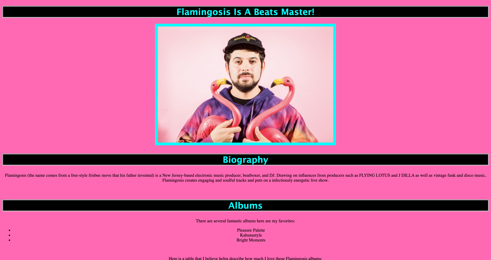
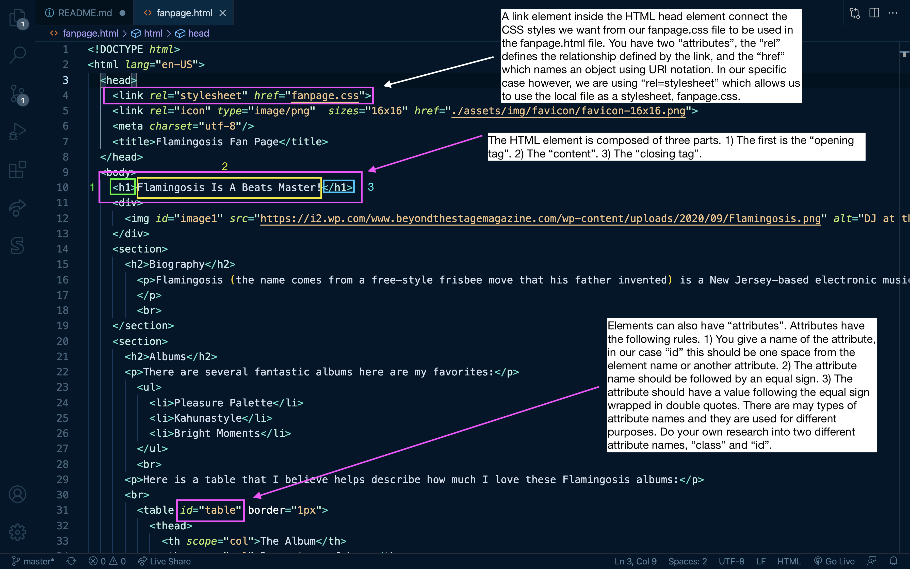
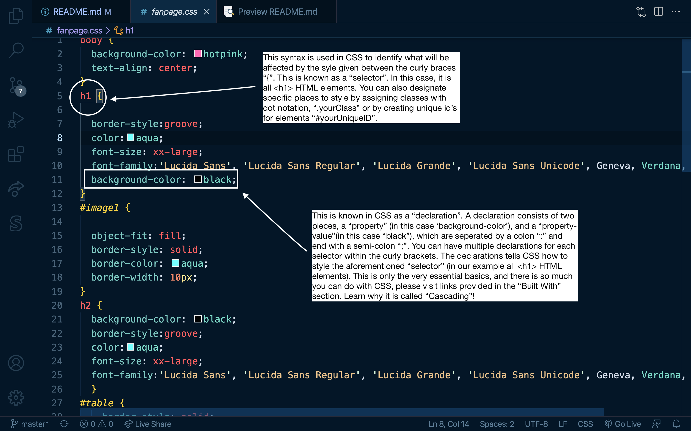

<h1 id="title">🎉 Flamingosis Fan Page 🎉</h1>


<p>An HTML and CSS practice excercise where I create a simple fan page for one of my favorite artist, Flamingosis.</p>


<h2>Table of Contents 📚<h2>

* [Installation](#installation)
* [Testing](#testing)
* [Walkthrough Video](#videoDemonstration)
* [Built With](#built)
* [Future Updates](#future)
* [Author](#author)
* [Contributions](#contribute)
* [Give Support](#Support)


<h2 id="installation">Installation 👨‍🏭</h2>


<p>Once you have a local installation of my remote repository, simply open the HTML <a href="https://developer.mozilla.org/en-US/docs/Web/HTML">(HyperText Markup Language)</a> file. The   <p>
```sh
fanpage.html
```

<p>in your local browser and experiment with replacing different elements with your desired content. You could make your own fan page of your favorite band.</p>

<p>&nbsp</p>

<h4>Flamingosis Fan Page</h4>

<p>&nbsp</p>



<p>&nbsp</p>


<h2 id="testing">Testing 👩‍🔬</h2> 


<p>There are two main folders that control the content/style of the page. The HTML file</p>

```sh
fanpage.html
```

<p>and the CSS <a href="https://developer.mozilla.org/en-US/docs/Web/CSS">(Cascading Style Sheet)</a> file. The CSS file is being linked to your HTML file through a link in the head element of the HTML file.</p>

```sh
fanpage.css
```

<p>You can control the content through the HTML file; either by changing the element itself, or replacing the data between the angled brackets. Feel free to play, explore, and experiment. If you would like to see examples of how you can change the content and style, please visit the <a href="#videoDemonstration">walkthrough video</a> I made.</p>

<p>&nbsp</p>

<h4>fanpage.html</h4>

<p>&nbsp</p>



<p>&nbsp</p>

<p>If you would like to control the <em>style</em> of the content, you will adjust the CSS file.</p>

<p>&nbsp</p>

<h4>fanpage.css</h4>

<p>&nbsp</p>



<p>&nbsp</p>

<p>There is so much you can do with just HTML and CSS. You can create simple websites easily, quickly, and most importantly, with <em>STYLE</em>.</p>

<p>&nbsp</p>

<h2 id="videoDemonstration">Video Demonstration 📹</h2>

<p>&nbsp</p>

<p>I give simple demonstrations of how you can adjust the HTML element content and CSS declarations to change the applications content and look.</p>

<p>&nbsp</p>

[Live application walkthrough](https://www.awesomescreenshot.com/video/4631437?key=8cec3f55f7e599f5cea0676322623f4f) 

<p>&nbsp</p>

<h2 id="built">Built With 🛠️</h2>

<p>Below you can learn more through these links, and also practice through tutorials to gain a deeper understanding of HTML5 and CSS3.</p>

<ul>
<li><strong><a href="https://developer.mozilla.org/en-US/docs/Learn/HTML">HTML</a></strong></li>
<li><strong><a href="https://www.w3schools.com/css/">CSS</a></strong></li>
</ul>

<p>&nbsp</p>

<h2 id="future">Future Updates ⏳</h2>

- [ ] What kind of website would you build with HTML & CSS?
- [ ] What is JavaScript, and what could you do with it in an application like this?


<p>&nbsp</p>

<h2 id="author">Author 👋</h2>

**John Patrick Banas**

- [GitHub Profile 🖥️](https://github.com/JohnBanas)
- [Email 📧](mailto:jbanas9124@gmail.com)
- [Portfolio 💼](https://johnbanas.github.io/portfolio/)

<p>&nbsp</p>

<h2 id="contribute">Contributions 💚</h2>

<p>None of this would be possible without the love and support of my wife Sam and our dog Teddy. Thank you to my nephew Mitchell for letting me help him with his homework, and discover that I actually love computer science, I just never knew. The wonderful folks at the Vanderbilt Owen School of Engineering Bootcamp. All the Instructors, TA's, Graders, Tutors, and Admin team who made my journey possible. Also to all the coders out there who teach me something new everyday, through Slack, StackOverflow, GitHub, Dev, Codecademy, Coursera, CodeNewbie, Udemy, Dataquest, and too many others to name here. I am grateful for the knowledge freely given, and I will freely give knowledge in return. Thank you most of all, to <strong><em>YOU</em></strong> for reading this far! <strong>👏 🤣</strong></p>

<p>&nbsp</p>

<h2 id="support">Give Support 🙌</h2>

<p>If you would like to contribute, or if you have any: commentary, corrections, questions, suggestions, please feel free to contact me through my email provided in the Author section. If you like the project, I would appreciate giving a ⭐ in support.</p>

[Back To Top of Page](#title)


